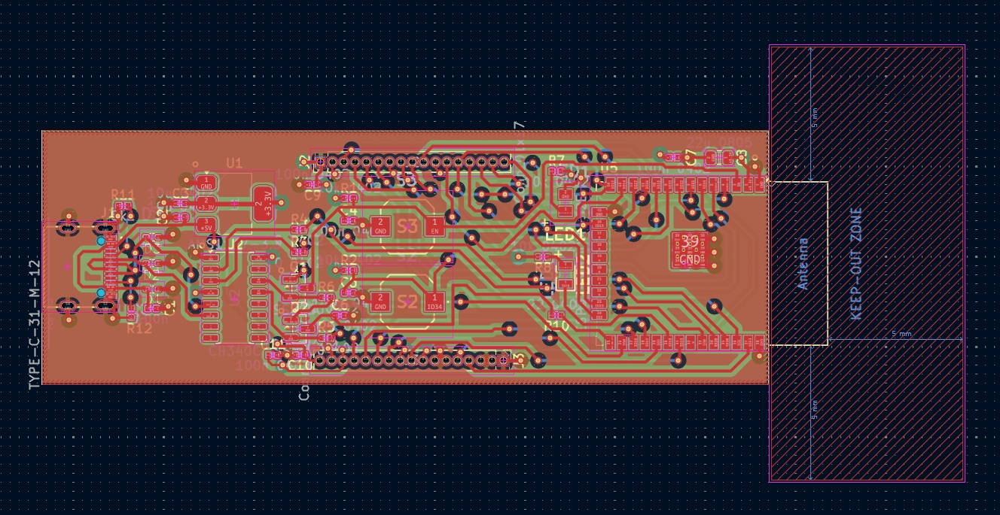
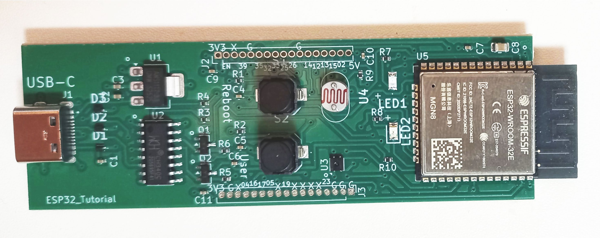
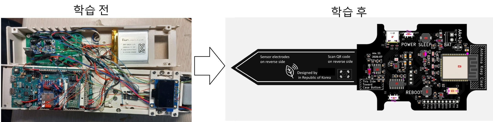

<h1 align="center">ESP32 Community Board Project</h1>

A complete ESP32 reference design built with KiCad.

## Preview

### PCB

### Schematic

An open community project for learning ESP32 hardware design with KiCad.

This repository contains a complete ESP32 development board designed in KiCad, intended for makers, students, and engineers who want to learn custom PCB design and build their own ESP32-based hardware.

 

## Professional Version - ESP32 Sensor Board

Need an ESP32 board with integrated sensors?

The **ESP32 Sensor Board** extends the Community Edition with a complete environmental sensing platform, making it suitable for IoT development, plant monitoring, and custom hardware projects.

### Professional Edition Includes

* SHTC3 temperature and humidity sensor
* Ambient light sensor
* Capacitive soil moisture sensor connector
* Complete KiCad project
* Schematic and PCB layout
* Symbol & footprint libraries
* BOM and Gerber files
* Component replacement guide
* Documentation

👉 **Professional Version on Gumroad**

https://greentam.gumroad.com/

If you're looking for a solid starting point for your next ESP32 hardware project, the Professional Edition is designed to save development time while remaining fully customizable.

 

## Features

- ESP32-WROOM-32E
- USB Serial (CH340)
- 3.3V Power Regulator
- Reset / User Buttons
- A status LED / A user LED
- Programming Circuit
- Expansion Headers
- Symbols and Footprints on Components
- Component Replacement Guide

The project file contains the 4-layer substrate layout (front signal, 3.3 volt plane, ground plane, and back signal), and satisfies the pcb specification of the manufacturer, JLCPCB. 
You can give an order by uploading the gerber files, placement file, and bill-of-materials included.
However, you can edit the files to match the specification of your chosen manufacturer.

 

## Who is this project for?

- ESP32 beginners
- Electronics hobbyists
- PCB designers
- Students
- Engineers learning KiCad
- Makers who want to build their own ESP32 board

 

## Community Edition

This repository contains the **Community Edition**.

The goal is to provide a minimal but practical ESP32 reference design that anyone can study and build.

 

## Documentation

- Component Replacement Guide
- Assembly Guide
- Hardware Documentation

 

## License

This project is licensed under the **Ippeul Community Hardware License (ICHL)**.

See the LICENSE file for details.

 

## Support

If you find this project useful, please consider:

- ⭐ Starring this repository
- Sharing it with other makers

  

<h1 align="center">KiCad를 이용한 ESP32 하드웨어 설계를 위한 ESP32 커뮤니티 보드</h1>

KiCad로 디자인한 기본 ESP32 보드

 

이 저장소는 KiCad로 설계된 완전한 ESP32 개발 보드 프로젝트를 포함하고 있으며, 커스텀 PCB 설계를 배우고 자신만의 ESP32 기반 하드웨어를 제작하려는 메이커, 학생, 엔지니어를 위해 제작되었습니다.

 

## ESP32 센서 보드 (유료 버전)

센서가 통합된 ESP32 보드를 찾고 계신가요?

**ESP32 Sensor Board**는 Community Edition을 기반으로 온도·습도, 조도, 토양 수분 센서를 지원하도록 확장된 전문 KiCad 프로젝트입니다. IoT 기기, 식물 관리 시스템, 환경 모니터링 장치 등 다양한 하드웨어 개발에 바로 활용할 수 있습니다.

### ESP32 Sensor 구성

* SHTC3 온도·습도 센서
* 조도 센서
* 정전용량식 토양 수분 센서 연결 헤더
* 완전한 KiCad 프로젝트
* 회로도 및 PCB 설계
* 심볼 및 풋프린트 라이브러리
* BOM 및 Gerber 파일
* 부품 교체 가이드
* 프로젝트 문서

👉 Gumroad에서 다운로드:

https://greentam.gumroad.com/

다음 ESP32 하드웨어 프로젝트를 보다 빠르게 시작하고 싶다면, ESP32 센서 보드는 검증된 회로와 PCB 설계를 바탕으로 개발 시간을 줄이면서도 자유롭게 수정하고 확장할 수 있는 기반을 제공합니다.

 

## ESP32 커뮤니티 보드 주요 기능 및 안내서
- ESP32-WROOM-32E
- USB 시리얼 인터페이스 (CH340)
- 3.3V 전압 레귤레이터
- Reset 버튼 / User 버튼
- 상태 표시 LED / 사용자 LED
- 펌웨어 다운로드 회로
- GPIO 확장 헤더
- 사용자 정의 심볼(Symbol) 및 풋프린트(Footprint)
- 대체 부품 가이드(Component Replacement Guide)

프로젝트 파일에는 4층 기판 구조가 포함되어 있습니다. 각 층은 전면 신호층, 3.3V 전원층, 접지층, 후면 신호층으로 구성되어 있으며, PCB 제조업체인 JLCPCB의 제작 사양을 충족합니다.
포함된 거버 파일, 부품 배치 파일, BOM(Bill of Materials)을 업로드하여 바로 제작을 주문할 수 있습니다.
다만 선택한 PCB 제조업체의 제작 사양에 맞게 프로젝트 파일을 수정하여 사용할 수도 있습니다.

 

## 이 프로젝트는 누구를 위한 것인가요?
- ESP32를 처음 배우는 개발자
- 전자공학 취미 활동가
- PCB 설계자
- 학생
- KiCad를 배우는 엔지니어
- 자신만의 ESP32 보드를 제작하고 싶은 메이커

 

## 커뮤니티 버전
이 저장소에는 Community Edition이 포함되어 있습니다.

이 프로젝트의 목표는 누구나 학습하고 직접 제작할 수 있는 최소한의 기능을 갖춘 실용적인 ESP32 레퍼런스 디자인을 제공하는 것입니다.

 

## 라이선스
이 프로젝트는 Ippeul Community Hardware License (ICHL)에 따라 배포됩니다.
자세한 내용은 LICENSE 파일을 참고하시기 바랍니다.

 

## 서포트
프로젝트가 도움이 되었다면

이 프로젝트가 도움이 되었다면 다음과 같은 방법으로 응원해 주세요.

 

- ⭐ GitHub 저장소에 Star를 눌러 주세요.
- 다른 메이커와 개발자들에게 프로젝트를 공유해 주세요.

  

# ESP32 PCB 설계와 제작법을 제대로 배우고 싶다면

## KiCad로 만드는 나만의 센서 보드

(강의에서 제작하는 pcb)
 

ESP32 개발보드와 센서 모듈을 점퍼선으로 연결하는 데는 익숙하지만, 나만의 PCB를 설계하는 것은 막막하게 느껴질 수 있습니다.
 

이 강의에서는 실제 ESP32 센서 보드 프로젝트를 예제로 사용하여 다음 과정을 단계별로 배웁니다.
 

- ESP32 기본 회로 이해
- USB-C 전원 및 3.3V 전원 회로 설계
- CH340 기반 펌웨어 다운로드 회로
- 센서와 버튼·LED 연결
- KiCad 회로도 및 PCB 설계
- PCB 제조 파일 생성 및 주문
- ESP32 펌웨어 작성
- BLE와 Wi-Fi 통신 구현
 

강의를 마치면 개발보드를 사용하는 수준을 넘어, 원하는 기능을 갖춘 ESP32 PCB를 이해하고 직접 수정하거나 설계할 수 있습니다.
 

## 이런 분께 추천합니다
- ESP32 개발보드는 사용해봤지만 PCB 설계는 처음인 분
- KiCad를 실제 프로젝트를 통해 배우고 싶은 분
- 센서 기반 IoT 기기나 교육용 보드를 만들고 싶은 메이커
- 하드웨어와 펌웨어를 함께 이해하고 싶은 개발자
- 자신만의 IoT 시제품을 만들고 싶은 예비 창업자
 

강의에서는 수정 가능한 KiCad 프로젝트와 단계별 펌웨어를 함께 제공하여, 이후 다양한 ESP32 기반 프로젝트의 출발점으로 활용할 수 있습니다.
 

개발보드를 사용하는 사람에서, 자신의 보드를 설계하는 사람으로 한 단계 성장해 보세요.
 

(좌: 아두이노와 센서들이 각종 배선으로 연결된 시스템, 우: 센서와 ESP32가 일체화된 정돈된 커스텀 pcb)
 

## 강의 링크
https://inf.run/ZeYXg

 
