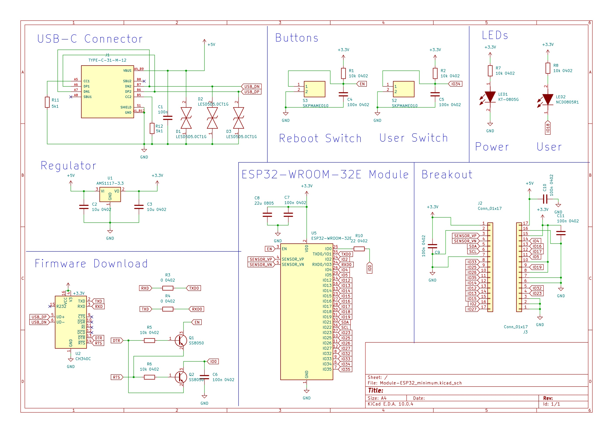

# ESP32 Community Hardware Project

An open community project for learning ESP32 hardware design with KiCad.

This repository contains a complete ESP32 development board designed in KiCad, intended for makers, students, and engineers who want to learn custom PCB design and build their own ESP32-based hardware.

---

## Features

- ESP32-WROOM-32E
- USB Serial (CH340)
- 3.3V Power Regulator
- Reset / User Buttons
- A status LED / A user LED
- Programming Circuit
- Expansion Headers
- Symbols and Footprints on Components
- Component Replacement Guide

---

## Preview

### PCB

### Schematic

---

## Who is this project for?

- ESP32 beginners
- Electronics hobbyists
- PCB designers
- Students
- Engineers learning KiCad
- Makers who want to build their own ESP32 board

---

## Community Edition

This repository contains the **Community Edition**.

The goal is to provide a minimal but practical ESP32 reference design that anyone can study and build.

---

## Professional Editions

Professional versions are available separately and include additional features such as:

- Buck-Boost Power Supply
- LiPo Battery Charger
- Ultra-Low-Power Design
- Battery Powered Operation
- Additional Sensors
- Production-ready Hardware

---

## Documentation

- Component Replacement Guide
- Assembly Guide
- Hardware Documentation

---

## License

This project is licensed under the **Ippeul Community Hardware License (ICHL)**.

See the LICENSE file for details.

---

## Website

https://www.ippeul.io

---

## Support

If you find this project useful, please consider:

- ⭐ Starring this repository
- Sharing it with other makers
- Visiting https://www.ippeul.io
